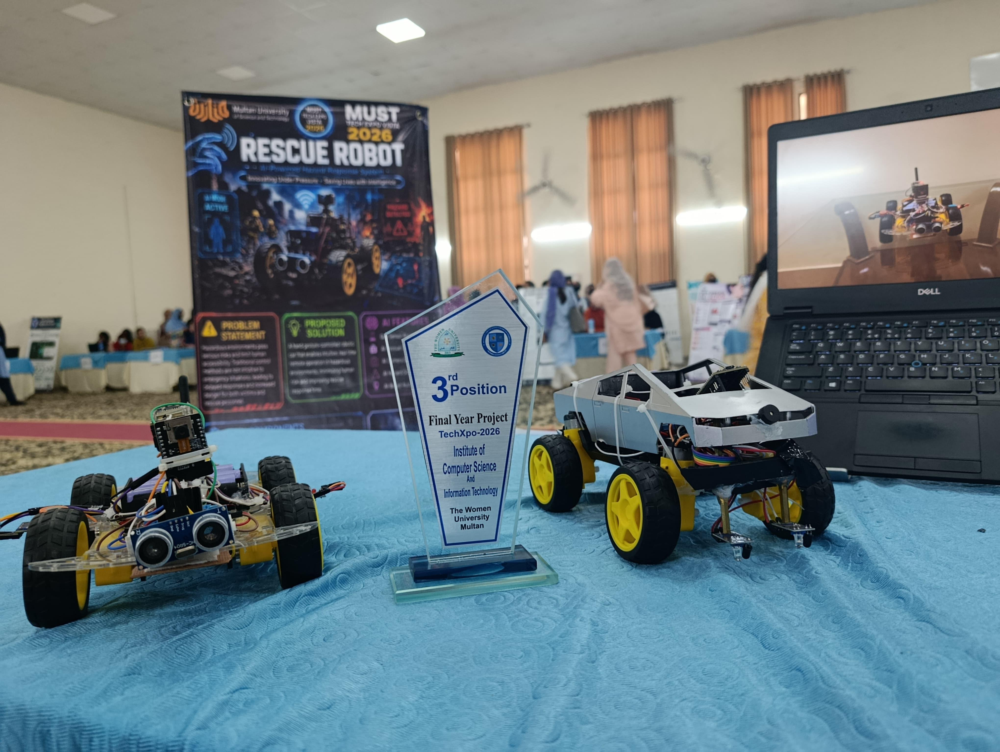
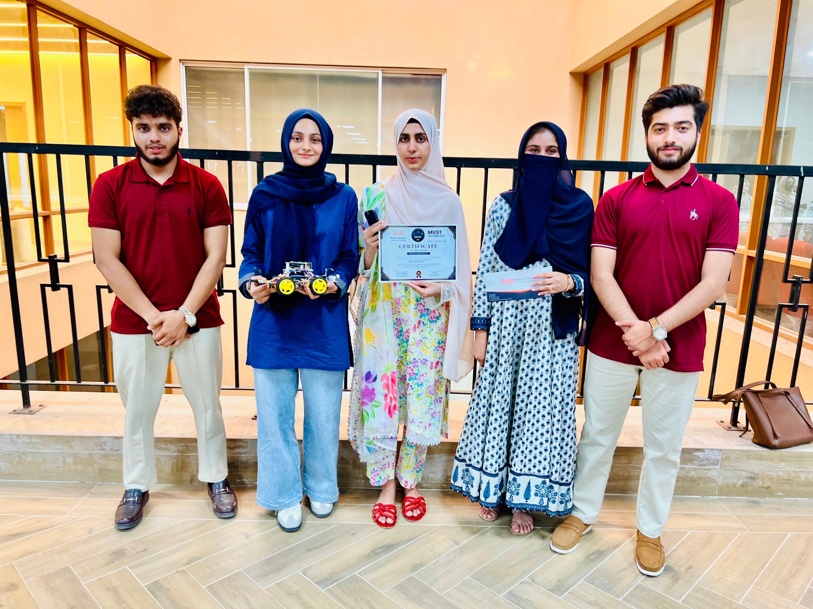
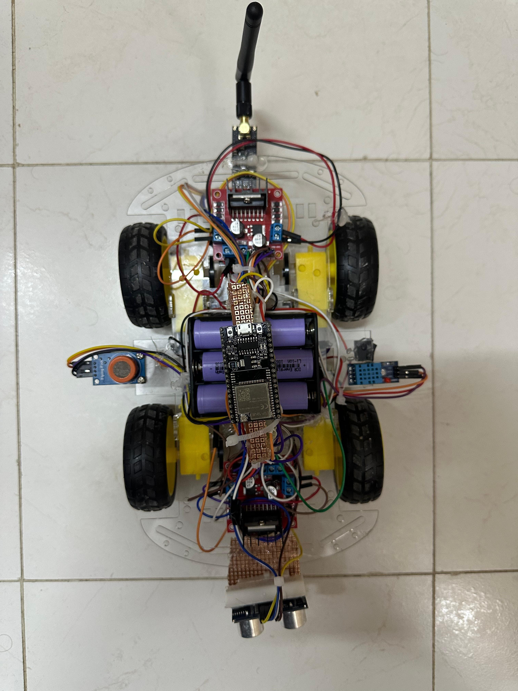

# 🤖 AI-Based Disaster Zone Search & Rescue Robot

> Built to enter hazardous environments so human rescuers don't have to.

**🥈 2nd Place — MUST Tech Expo 2026**  
**🥉 3rd Place — TECHxpo 2026, Women University Multan**

A fully functional, low-cost, AI-assisted disaster zone search and rescue robot built by a five-member undergraduate team at Multan University of Science and Technology. The system keeps operators safe by performing remote reconnaissance in environments too dangerous for human entry.

---

## 🏆 Awards

| Competition | Result |
|-------------|--------|
| MUST Tech Expo 2026 | 🥈 2nd Position |
| TECHxpo 2026 — Women University Multan | 🥉 3rd Position |

---

## 📸 Gallery

<p align="center">
  
  
</p>
<p align="center">
  
  
</p>

---

## 🧠 What It Does

The system has three physical modules and one AI-powered browser dashboard:

| Module | Components |
|--------|-----------|
| Gesture Glove (Transmitter) | ESP32 WROOM + MPU6500 IMU + NRF24L01 |
| Robot Car | ESP32 WROOM + L298N + HC-SR04 + MQ-3 + DHT11 + NRF24L01 |
| Live Camera | ESP32-CAM (MJPEG stream over WiFi) |
| Operator Dashboard | Browser-based HTML/CSS/JS + Groq API |

---

## ✋ Gesture-Controlled Glove

The operator never touches a joystick. They simply tilt their hand:

- **Tilt forward** → robot moves forward
- **Tilt back** → robot reverses
- **Tilt left/right** → robot turns

The MPU6500 IMU reads pitch and roll using a complementary filter. Commands transmit via NRF24L01 at 2.4 GHz with **under 20ms latency** and 97% command accuracy in testing.

---

## 🤖 Five AI Features — All at Zero Cost

### 1. 📊 Z-Score Gas Anomaly Detection
Runs entirely in the browser — no API needed. Applies Z-score statistical analysis on the rolling MQ-3 gas stream to detect real hazards vs. sensor noise. Zero false positives on noisy baseline data in testing, vs. 12 false alerts from a simple threshold approach.

### 2. 📝 AI Hazard Situation Report
Every 15 seconds, all live sensor values are sent to **Groq + Llama 3.3** which generates a 2-sentence plain-English situation report for the operator. Leads with the most critical finding. Average response time: 1.2 seconds.

### 3. 👁️ Computer Vision Survivor Detection
Captures still frames from the ESP32-CAM and sends them to **Llama 4 Scout Vision** via Groq API. Detects people, fire, and smoke. 87% detection accuracy on test frames including partial occlusion.

### 4. 💬 Rescue Co-Pilot Chatbot
A conversational AI assistant the operator can query at any time. The system prompt is rebuilt on every message with the latest sensor readings — so the AI always has live context. Supports multi-turn conversation with 10-exchange memory.

### 5. 🚗 On-Device Fuzzy Logic Autonomous Navigation
Runs entirely on the ESP32 firmware — **no internet required**. A 6-state finite state machine governs obstacle avoidance using HC-SR04 distance zones, predictive approach detection via 8-value ring buffer, and an emergency gas halt that stops all motors when MQ-3 exceeds 300 ppm. 90% success rate in corridor obstacle testing.

---

## 🔧 Hardware Components

| Component | Function |
|-----------|---------|
| ESP32 WROOM-32 (×2) | Main microcontroller for glove and robot car |
| MPU6500 IMU | 6-axis hand tilt detection |
| NRF24L01 (×2) | 2.4 GHz wireless command link |
| L298N Motor Driver | Controls 4 DC motors |
| HC-SR04 Ultrasonic | Obstacle detection (2–400 cm) |
| MQ-3 Gas Sensor | Detects LPG, methane, alcohol vapour |
| DHT11 | Temperature and humidity monitoring |
| ESP32-CAM | Live MJPEG video stream |
| LM2596 Buck Converter | Power regulation (12V → 5V/3.3V) |
| LiPo 3S 2200mAh | ~90 min robot runtime |

**Total bill of materials: under PKR 8,000** (~$28 USD)

---

## 📡 System Architecture

```
Operator Hand Tilt
      ↓
MPU6500 → ESP32 (Glove) → NRF24L01 ──────────────→ NRF24L01 → ESP32 (Car)
                                                                     ↓
                                                          L298N → 4× DC Motors
                                                          HC-SR04 → Obstacle AI
                                                          MQ-3 → Gas Detection
                                                          DHT11 → Temp/Humidity
                                                          ESP32-CAM → WiFi Stream
                                                                     ↓
                                                         Browser Dashboard
                                                         (AI Features + Groq API)
```

---

## 🧪 Test Results

| Feature | Result |
|---------|--------|
| Gesture command accuracy | 97% (97/100 trials) |
| Command latency | < 20ms |
| Obstacle avoidance success | 90% (18/20 trials) |
| AI hazard report accuracy | 93% (28/30 scenarios) |
| Survivor detection accuracy | 87% (13/15 frames) |
| Gas anomaly false positives | 0 (vs. 12 with simple threshold) |

---

## 🔒 Code

This is a showcase repository. The source code is private.  
For inquiries, reach out via [LinkedIn](https://www.linkedin.com/in/laiba-fatima-1).

---

## 👥 Team

| Name | Roll Number |
|------|------------|
| Laiba Fatima | 2024-CS-F108 |
| Varisha Fatima | 2024-CS-F080 |
| Ramla Pervaiz | 2024-CS-F067 |
| Muhammad Zain Zaheer | 2024-CS-F065 |
| Sheikh Mubbashir Ali | 2024-CS-F073 |

**Supervisor:** Prof. Dr. Muhammad Numair  
**Institution:** Multan University of Science and Technology (MUST)  
**Department:** Computer Science & Engineering  
**Academic Year:** 2025–2026
